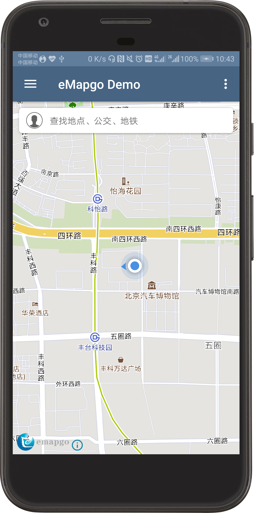
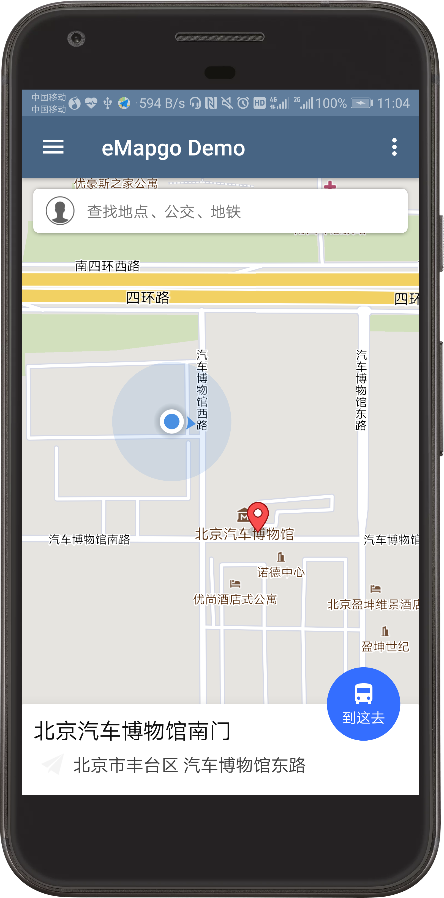
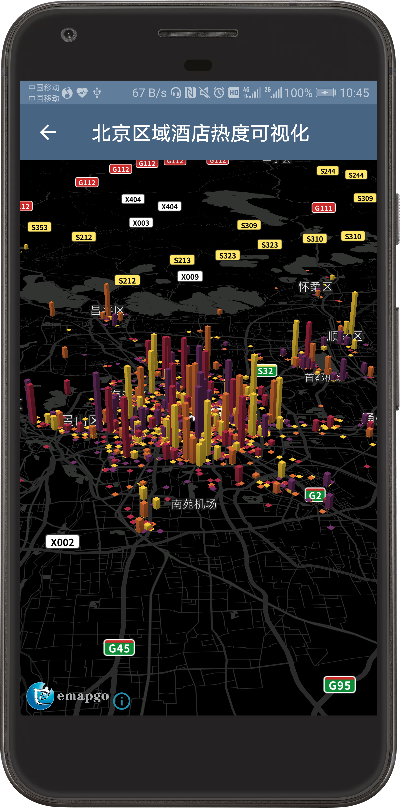
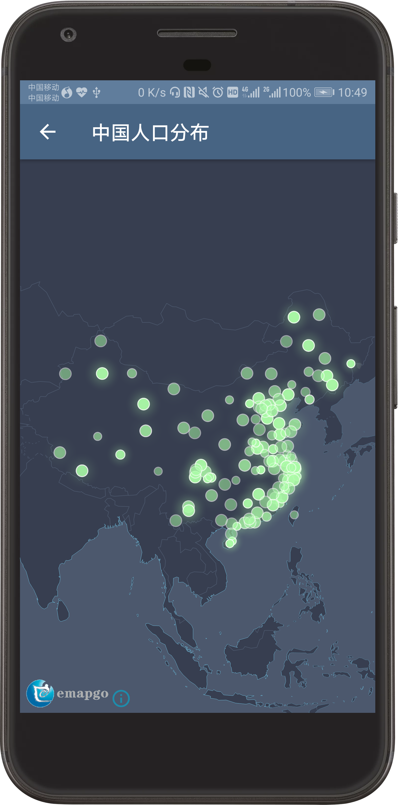
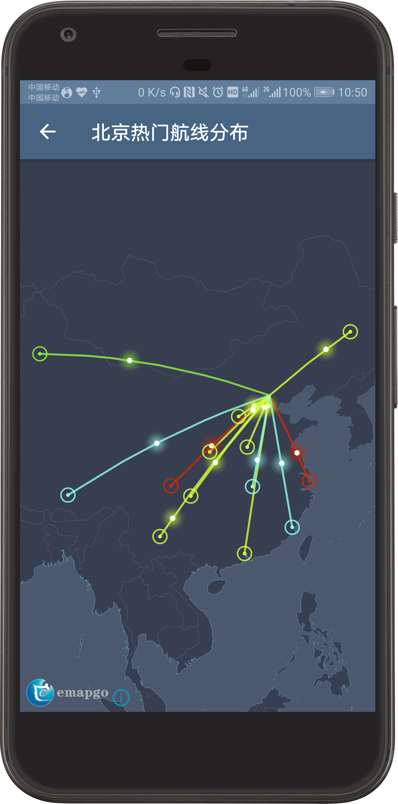
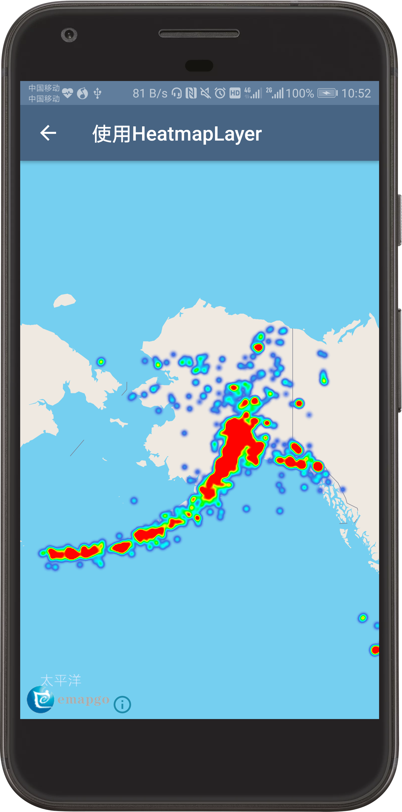
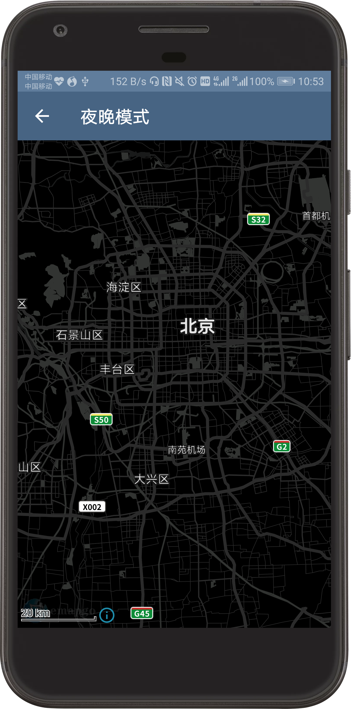
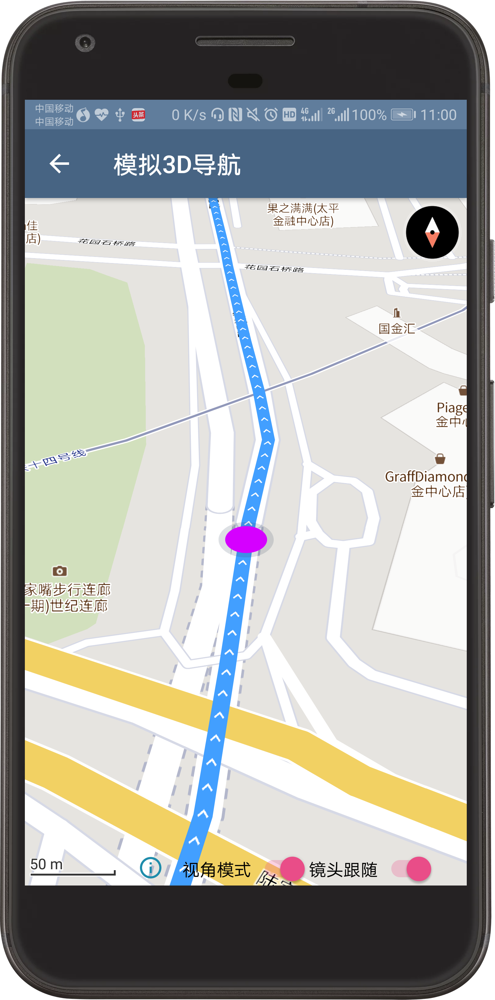

# eMapgoMapSDK for Android（beta版）
#### 这是适用于Android的eMapgo Maps SDK的部分demo演示，若要使用POI检索等服务，请在values/strings.xml中配置key和secret。
#### 在该实例程序中展示了部分SDK功能
* 常规地图的加载
* 地图定位SDK的应用
* 地图组件、地图手势、地图事件等
* POI服务检索以及路线规划
* 使用eMapgoSDK呈现数据可视化效果
* 使用eMapgoSDK的Runtime Styling实现自定义地图底图
* ....

 
 
 
 
 
 
 
 
